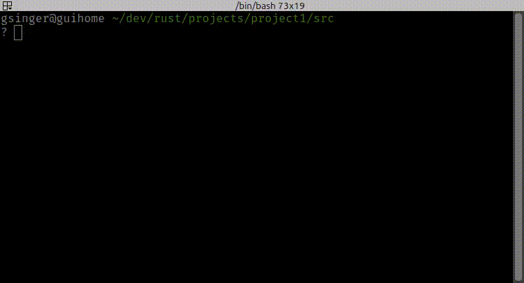

# cdd - Change Directory Destination 
(yet another change directory shell tool)

**Version:** v1.2  
**Author:** Guillaume Singer

**cdd** is a lightweight Bash script that simplifies navigation in your terminal by allowing you to quickly jump to frequently used directories using user-defined shortcuts. \
Instead of typing out full or relative paths, you can assign these paths to easy-to-remember shortcuts, streamline your workflow, and save valuable time.

---

## Features

- **Change Directory:** Jump to a saved directory by simply typing its shortcut.
- **Assign Shortcuts:** Bind any directory to a shortcut for later use.
- **List Shortcuts:** View all your pre-defined shortcuts along with their directory paths.
- **Remove Shortcuts:** Delete any shortcut that you no longer need.




---

## installation

1. Copy `cdd_run` file  where your want in your system (usually, I put it in my home directory).\
   Don't forget to make it executable (`chmod +x ./cdd_run`)
2. Because the script changes the current directory it cannot be launched in a different bach process from your current session. \
   It must be launched by the `source` command. Just add the alias in your `~/.bashrc` file:

```bash
alias cdd='source ~/cdd_run'
```
3. Last step : restart your terminal (or run `source ~/.bashrc`) 


## usage

run `cdd` without arguments to display the usage : 
```
Usage:
    . cdd <shortcut>[/subdir]  Change directory to the <shortcut> one
                               shortcut can be followed by a subdir
    . cdd <shortcut> <target>  Assign the shortcut to the <target>* directory 
                               <target> : absolute or relative path
    . cdd --list               List all shortcuts (alias : -l)
    . cdd --rm <shortcut>      Remove the specified shortcut.

Examples:
      cdd prj ~/dev/myproject
      cdd prj                 # jump to ~/dev/myproject
      cdd prj/output          # jump to ~/dev/myproject/output
      cdd -l                  # list all shortcuts
      cdd --rm prj            # remove the shortcut 'prj'
```


## How It Works

The script stores your shortcuts in a hidden file located at `~/.cdd` (in csv format, with ';' as separator)

